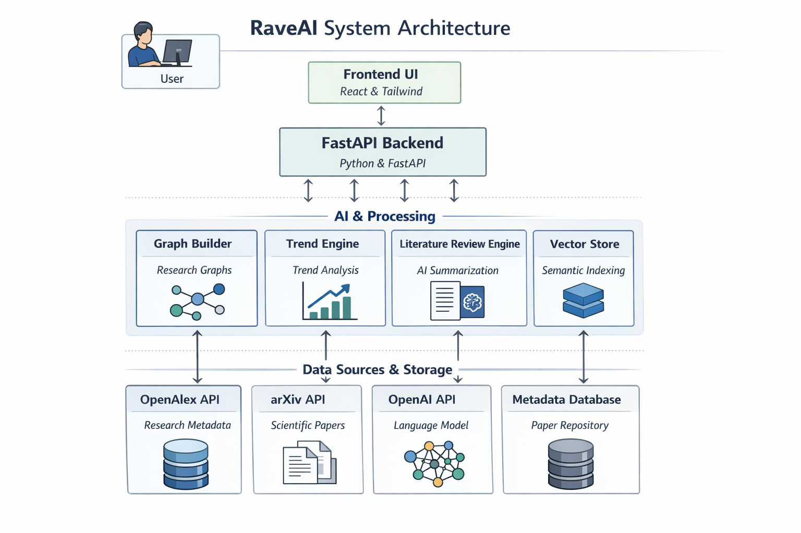

# RaveAI

Rave is an AI co-researcher that understands papers, connects ideas, detects research gaps, and helps generate literature reviews.

This repository includes an MVP with:
- FastAPI backend for ingestion, search, graphing, reasoning, and review generation
- Chroma vector store for semantic retrieval
- SQLModel persistence (SQLite default, Postgres-ready)
- Next.js frontend for topic search, paper exploration, Q&A, and review generation

## System Architecture
<p align="center">
  
</p>

## Backend setup

```bash
cd backend
python -m venv .venv
source .venv/bin/activate
pip install -r requirements.txt
cp .env.example .env
python -m uvicorn app.main:app --reload --port 8000
```

Open API docs at: `http://localhost:8000/docs`

## Frontend setup

```bash
cd frontend
npm install
npm run dev
```

Open app at: `http://localhost:3000`

## Free AI Setup (No paid API key)

Rave now defaults to local Ollama for both generation and embeddings.

1. Install Ollama: [https://ollama.com/download](https://ollama.com/download)
2. Pull models:

```bash
ollama pull llama3.1:8b
ollama pull nomic-embed-text
```

3. Ensure backend `.env` has:

```bash
LLM_PROVIDER=ollama
EMBEDDING_PROVIDER=ollama
OLLAMA_BASE_URL=http://localhost:11434
OLLAMA_CHAT_MODEL=llama3.1:8b
OLLAMA_EMBED_MODEL=nomic-embed-text
```

If Ollama is unavailable, services fall back to mock mode.

## Free Research Data Stack

Ingestion uses:
- `OpenAlex` (primary retrieval; free)
- `arXiv` API (fallback/expansion; free)
- `Semantic Scholar` (optional enrichment if key is provided)

## API flow

1. `POST /api/v1/papers/ingest`
2. `GET /api/v1/papers`
3. `POST /api/v1/reasoning/ask`
4. `POST /api/v1/reviews/generate`
5. `GET /api/v1/graph`

## Environment

Backend `.env`:
- `LLM_PROVIDER=ollama|openai|mock`
- `EMBEDDING_PROVIDER=ollama|openai|mock`
- `OLLAMA_BASE_URL=http://localhost:11434`
- `OLLAMA_CHAT_MODEL=llama3.1:8b`
- `OLLAMA_EMBED_MODEL=nomic-embed-text`
- `OPENAI_API_KEY=` (optional)
- `OPENALEX_EMAIL=` (optional but recommended)
- `SEMANTIC_SCHOLAR_API_KEY=` (optional)

## Notes

- Existing papers are deduplicated by `external_id`.
- If external APIs are unavailable, ingestion falls back to mock papers.
